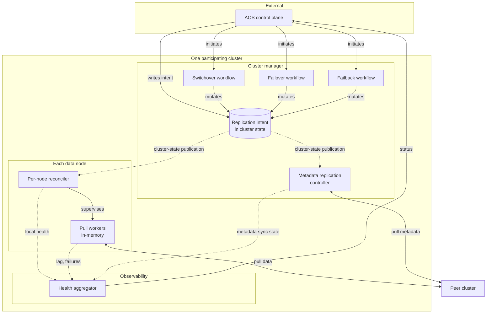

# Full-cluster replication: architecture

System-level view of the components inside a cluster that participates in full-cluster replication, how they fit together, and how a few representative operations flow through them. The product contract is defined in the AOS DR product definition (summarized in `switchover-design.md`); this document is about how we build a cluster to satisfy it.

The external AOS control plane is **not** described here. This is in-cluster architecture only.

## Guiding constraints

These shape every choice below. Calling them out up front so the rationale for each component is legible.

- **Cluster-scoped, not per-index.** One replication relationship per cluster. The customer initiates one switchover, not N.
- **Declarative intent, not imperative commands.** The external control plane tells the cluster what it should be doing, not what to do step by step. In-cluster components drive the cluster toward that intent.
- **Cluster-state traffic proportional to intent changes, not to shard count.** Lifecycle churn inside the cluster (worker starts, retries, pauses) must not emit cluster-state updates. This is the core fix for the persistent-tasks scaling failure mode.
- **Per-node parallelism, no central fan-out.** Anything that scales with shard count is done by the node hosting the shard. The cluster manager is not a message bus to data nodes.
- **Full domain, not just indices.** User data is one category of state. Index templates, aliases, ingest pipelines, plugin state, and others need the same replication guarantees. Architecture has to accommodate categories beyond user indices from day one.

## System overview



## The intent document

The single source of truth for "what this cluster should be doing." Lives in cluster state, cluster-scoped (one document per cluster, not per index).

```
replication.intent: {
  peer_cluster: <id>,
  role: primary | secondary,
  replicated_indices: [<name>, ...],
  epoch: <long>,
  status: steady | switching:<phase> | failing_over | failed_back | aborted,
}
```

Two classes of writer:

- **External control plane** writes the "stable" parts: which cluster is the peer, which indices are replicated, role transitions that require cross-cluster agreement.
- **In-cluster workflows** (switchover, failover, failback) write the "transitional" parts: phase states during a role change, epoch bumps.

Everything else in the cluster is a *reader* of the intent.

Intent mutations are the only thing that emit cluster-state updates related to replication. Worker lifecycle, retries, retention lease renewals — all in-memory on the data nodes.

## The components

### Cluster manager components

**Switchover workflow.** Linear multi-phase state machine for managed switchover (both clusters healthy, no data loss). Fence → handoff checkpoint → drain → promote → demote → reverse-start. Runs on the cluster manager because it needs durable backing via cluster state (so cluster-manager failover resumes it cleanly) and because it's a one-shot sequenced operation that doesn't benefit from per-node parallelism. Output is intent mutations; per-node reconcilers consume them.

**Failover workflow.** Same shape as switchover structurally, but shorter and different semantics. No quiescence, no cooperation with the former primary. Promotes every replicated index unilaterally. Responsible for enforcing the "writes discarded on failback" contract by carrying enough state to drive the subsequent re-bootstrap.

**Failback workflow.** Re-bootstrap of the former primary. Tears down replicated indices on the recovering cluster and restarts them fresh from the new primary. Interacts with metadata replication to land in a consistent state across all replicated categories.

**Metadata replication controller.** The "full domain" half of the product. Ships index templates, component templates, aliases, ingest pipelines, ISM policies, and other replicable categories from the primary to the secondary. Runs on the cluster manager because cluster-state metadata is cluster-manager-scoped; it publishes the relevant pieces out of local cluster state and applies incoming changes from the peer. Plugin state rides on the same machinery via a plugin SPI.

The workflows and the metadata controller are all cluster-manager-scoped. Cluster-manager failover re-picks-up their state from the intent document and from their own persistent cluster-state entries. No in-flight in-memory state assumed to survive a failover.

### Data node components

**Per-node reconciler.** One loop per data node. Observes the intent via normal cluster-state publication and computes a local slice: "for the shards of replicated indices that are assigned to this node, which workers should exist?" Starts, stops, and supervises workers. Does not cause cluster-state updates in response to worker lifecycle events.

**Pull workers.** In-memory, one per replicated primary shard hosted on this node. Pulls operations from the peer cluster's corresponding shard, applies them locally. Essentially what today's `ShardReplicationTask` does, but stripped of its cluster-state representation. Failure isolation and per-shard timing (backoff, long-poll cadence) live inside the worker.

### Cross-cutting

**Health aggregator.** Pulls per-node reconciler state and per-worker metrics into a cluster-scoped health view. Exposes an API the control plane polls, and emits metrics/events per the product definition. Crucially, its inputs are exactly what each node's reconciler already knows locally (worker health, lag, stuck shards) — it doesn't require any new state collection.

## How a request flows

### Steady-state replication

1. Primary cluster accepts a client write. Normal admission, normal indexing.
2. Pull workers on the secondary cluster poll the primary for changes per shard. Each worker is a coroutine on the node hosting that shard's follower primary.
3. Worker applies changes locally via the existing `ReplayChangesAction` path.
4. Periodically, each worker renews its retention lease on the peer shard.
5. The metadata replication controller polls or streams the primary's relevant cluster-state categories; applies changes locally.

Nothing in this flow emits cluster-state updates on either side. Everything is in-memory worker state (on data nodes) and peer-to-peer transport traffic.

### Customer adds an index to replication

1. Control plane writes an intent update: `replicated_indices` gains a new name.
2. Intent update publishes through cluster-state to every data node.
3. On the primary side: the metadata replication controller notices and starts including the new index's metadata in the ship-to-peer stream.
4. On the secondary side: each data node's reconciler sees the new index, starts pull workers for the shards it hosts once the index exists locally (after bootstrap via snapshot restore, triggered by the reconciler).
5. When bootstrap completes, workers transition to steady-state pulling.

One cluster-state update per side for the intent change. Plus any cluster-state updates required by the normal bootstrap path (index creation, settings application). No per-shard updates after that.

### Customer initiates switchover

1. Control plane calls a switchover API on the primary cluster.
2. Switchover workflow starts on the primary's cluster manager. First intent mutation: `status: switching:fenced`.
3. Intent publishes; the existing write-path admission sees the `switching` status and rejects new writes.
4. Workflow advances: computes handoff checkpoints across all replicated indices.
5. Workflow mutates intent: `status: switching:drained`. Secondary's reconcilers observe this and wait for their local workers to catch up to the handoff checkpoints.
6. Secondary's workflow (initiated by the same control plane call on that side, or by the primary calling over) performs the promote — shard-level engine swap on each node hosting a primary shard. The per-node reconciler drives its local slice of the promote.
7. Primary's workflow performs the demote on its side.
8. Workflow mutates intent on both sides: `role` flipped, `status: steady`, epoch bumped.
9. New primary's pull workers (now on what was the former primary) start pulling in the reverse direction.

Intent mutations per phase: ~5 on each side. No per-shard cluster-state traffic.

### A node fails mid-replication

1. The node disappears. Cluster manager detects, reallocates its shards to other nodes (normal OpenSearch shard allocation).
2. Each node that receives a reallocated shard sees the normal cluster-state update about the new shard assignment.
3. That node's reconciler includes the new shard in its local slice on the next reconcile cycle.
4. Reconciler starts a pull worker for the new shard. Worker resumes pulling from the last known local checkpoint.

The intent document is unchanged throughout. No CCR-specific code runs on the cluster manager during the node failure. Everything falls out of cluster-state publication + per-node reconciliation.

## What this architecture deliberately does not include

- **Cross-cluster consensus.** The two clusters do not vote on anything. The external control plane is the arbiter for any decision that requires both sides to agree.
- **Automatic failover.** Failover is always customer-initiated.
- **Automatic reconciliation after split brain.** Post-failover, if the former primary reappears, it's quarantined until the customer initiates failback (which re-bootstraps it).
- **Metadata consensus across the link.** Each cluster has its own cluster-state version space. The metadata replication controller ships categories as a forward-only stream from primary to secondary; the secondary's cluster-state version is its own.

## How the work streams map onto the components

| Work stream | Components it builds |
|---|---|
| 1. Reconciler-based control plane | Intent document shape; per-node reconciler; in-memory pull workers; migration |
| 2. Metadata replication | Metadata replication controller; per-category apply logic |
| 3. Plugin state SPI | The plugin-author-facing part of the metadata controller |
| 4. Cluster-scoped switchover workflow | Switchover workflow on cluster manager; phase states in intent |
| 5. Failover | Failover workflow on cluster manager |
| 6. Failback with re-bootstrap | Failback workflow on cluster manager; coordination with metadata controller |
| 7. Observability and health | Health aggregator; status API; metrics/events |

See `work-streams.md` for the work-stream-level view, `reconciler.md` for the reconciler design, `switchover-design.md` for the switchover protocol, and `abort-high-level-design.md` for abort semantics.
