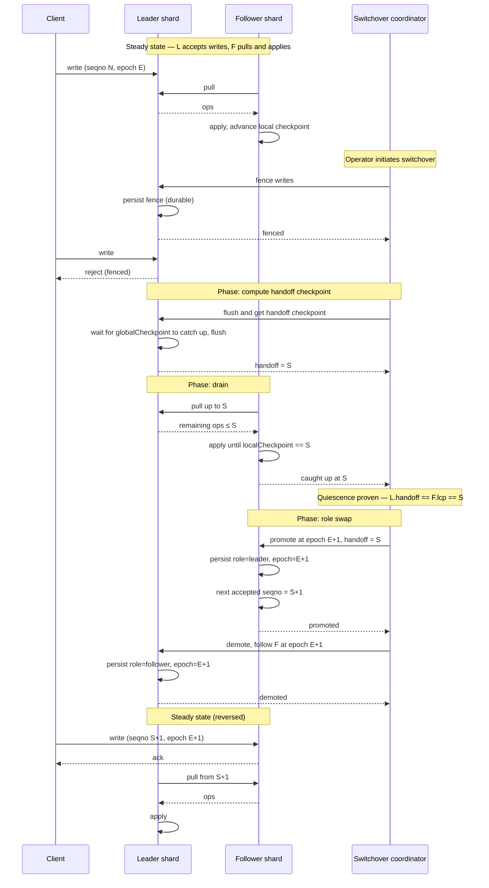
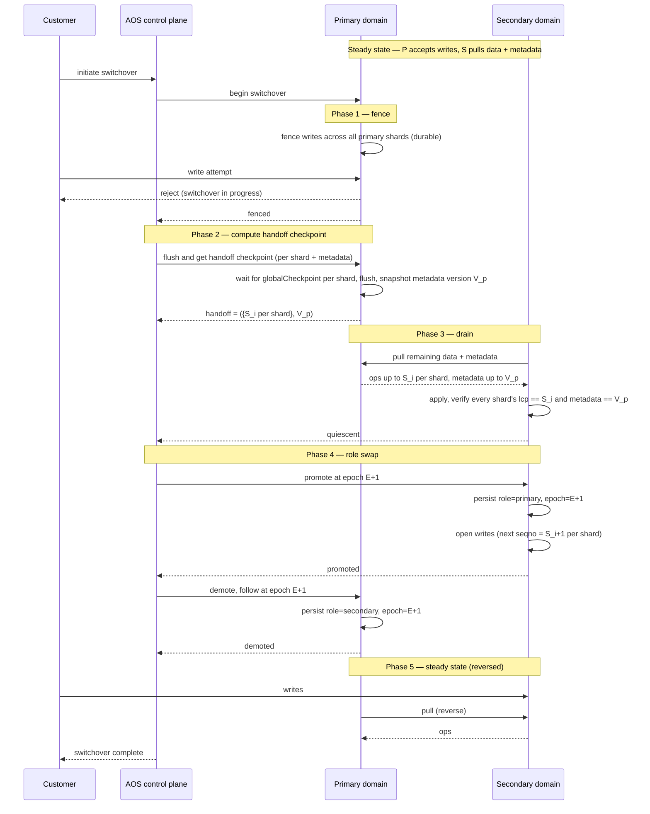

# Switchover design

Switchover is the planned, no-data-loss recovery operation: both regions are healthy, the customer initiates the swap, and the primary/secondary roles are exchanged at the cost of a bounded write-unavailability window.

This document sketches the protocol at two levels: a single shard (the data-layer primitive) and the domain as a whole (what the customer initiates).

Terminology: "leader/follower" is used at the shard level for the data-layer protocol; "primary/secondary" is used at the domain level to match the customer-facing product definition. They map 1:1.

## Shard-level switchover

The data-layer primitive. Given one leader shard `L` and one follower shard `F`, reverse the direction of replication with no data loss and without any window in which both sides accept writes.

### Invariants the protocol enforces

- **Durable fence.** The fence in phase 1 is persisted, not held in memory. If `L` crashes and recovers mid-switchover, it must come back fenced — a recovered leader that resumes accepting writes would break the no-data-loss guarantee.
- **No dual-write window.** `L` is fenced before `F` is promoted; `F` is promoted before `L` is told to demote. If the coordinator dies between promoting `F` and demoting `L`, `L` remains fenced. Safe, but stuck until the coordinator retries.
- **Unambiguous reversed stream.** The epoch bump on promotion (`E → E+1`) ensures ops produced by `F` after the swap carry `(seqno ≥ S+1, epoch E+1)`, while ops produced by `L` before the swap carry `(seqno ≤ S, epoch E)`. No `(seqno, epoch)` tuple is reused across the swap, so the follower side of the reversed stream can detect stale or replayed ops unambiguously.
- **Handoff continuity.** `L`'s state at `S` is byte-equivalent to `F`'s state at `S` by the quiescence check in phase 2. Applying `F`'s ops `S+1, S+2, …` on top of `L`'s state is safe.

## Domain-level switchover

What the customer actually initiates. Fans the shard-level primitive out across every replicated shard in the domain, plus the metadata stream, coordinated by the AOS control plane.

### What changes at the domain level vs. the shard-level version

- **Quiescence is a conjunction.** The secondary only reports caught-up when every replicated shard's local checkpoint equals its handoff seqno *and* the metadata stream has been applied through the primary's handoff metadata version `V_p`. Any single shard lagging keeps the whole domain in phase 3.
- **Control plane as coordinator.** The AOS control plane is the natural coordinator: it is already the thing the customer is calling, it has durable state outside either cluster, and it owns the decision record "at epoch E+1, secondary is primary." Neither cluster manager needs to trust the other unilaterally.
- **Fence fan-out.** The fence is a domain-level operation that must reach every primary shard. If any single shard cannot be fenced promptly (for example, a gray failure on that shard during an otherwise healthy domain), the switchover must fail cleanly, unfence whatever was fenced, and leave the customer to retry or choose failover instead.
- **Metadata handoff.** Shown as a single step but hides a real problem: `V_p` is in the primary's cluster-state namespace, and the secondary has its own. Proving "the secondary has applied everything up to `V_p`" requires a replication-layer sequence over metadata that is meaningful on both sides. See open questions.

## Open questions

- **Metadata equality.** How is `V_p` expressed in a way both clusters can agree on, given that each has its own cluster-state version space? Likely needs a replication-layer monotonic sequence over metadata changes, independent of either local cluster-state version.
- **Partial-fence failure.** What exactly does the primary do if it cannot fence one shard during phase 1? Rolling back a partial fence needs to be as durable as the fence itself.
- **Coordinator liveness.** The protocol is safe under coordinator crash (the worst case is a stuck-fenced primary), but the operational story for recovery — who retries, with what idempotency — needs to be specified.
- **Epoch representation.** OpenSearch's primary term is cluster-local. The cross-cluster epoch introduced here is a new concept and needs a concrete home (per-shard metadata, persisted alongside the fence marker, monotonic across swaps).
